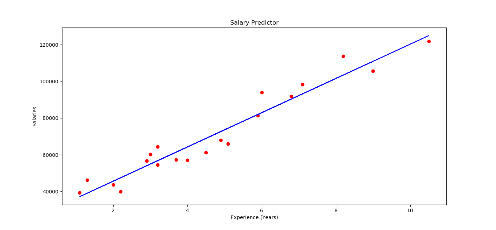
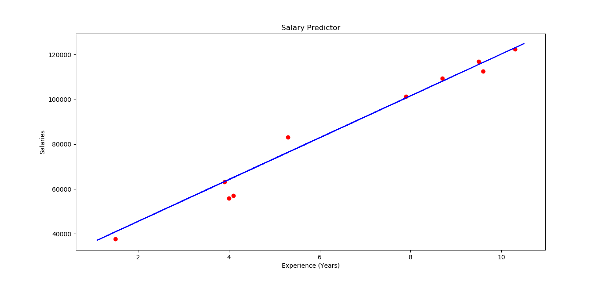

# Salary Predictor

## About:

This is a python script created to understand and implement Simple Linear Regression model to render salary of an employee w.r.t the years of experience in retrospect to previously employed candidates.

## Dataset:

The csv file Salary_Data is used as a dataset for implementing regression model. It consists of two columns:

i. Experience: Number of years worked in a company.

ii. Salary: Payment offered corresponding to the work experience.

## Working:

Simple Linear Regression conforms to the following equation:

y = b0 + ( b1 * x)

Where:

y: Dependent variable
x: independent variable
b1: Coefficient to independent variable
b0: Constant (Starting point of slope)

#### I. Preprocessing
After importing the dataset, it is the columns are assigned as per the dependency- Since salary is directly proportional to the Experience, it is considered as a dependent variable while the latter is considered as independent variable.

After assigning the variables, The dataset is divided into training and test set. 1/3rd of dataset is subsumed into test set.

Advantage of this is that feature scaling doesn't need to be done in this case since LinearRegression package takes care of the values.

#### II. Building Regression model

Importing LinearRegression package from sklearn to train the dataset using fit method, which is followed by predict method to predict one or multiple values. The visualizations for training and test set is displayed below.

#### III. Visualizations:

The graph above displays the actual salaries (Red) and predicted salaries (regression line) using Training set.

The graph above displays the actual salaries (Red) and predicted salaries (regression line of training set) using Test set.
